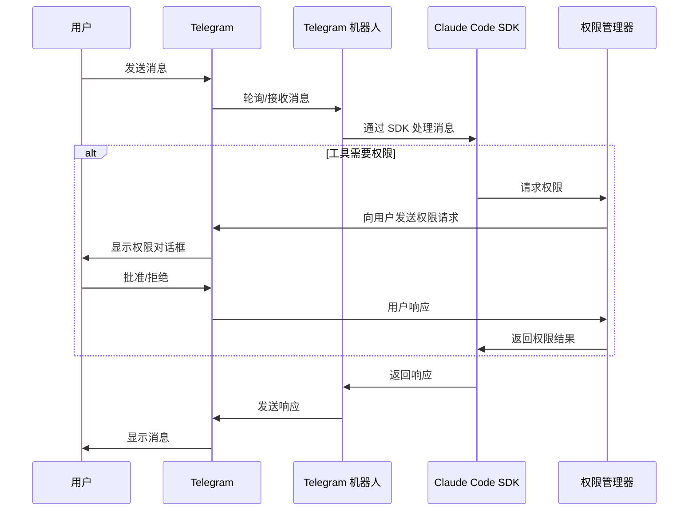

# Telegram Claude Code 机器人

一个强大的 Telegram 机器人，集成了 Claude Code 功能，直接通过 Telegram 提供 AI 驱动的编程辅助。**使用 Telegram 轮询模式 - 可在任何有互联网连接的计算机上运行，无需公网 IP 或域名。**

该机器人允许用户在对话界面中与 Claude 的编程能力进行交互，具有项目管理、文件浏览和全面权限控制等功能。

## 功能特性

- **Claude Code 集成**：直接集成 Anthropic 的 Claude Code SDK
- **项目管理**：创建、列表和管理编程项目
- **文件浏览器**：通过 Telegram 导航和探索项目目录
- **权限系统**：多种权限模式确保安全交互
- **会话管理**：使用 Redis 或内存存储的持久用户会话
- **工具处理**：高级工具使用检测和管理
- **消息批处理**：高效的消息处理和传送
- **权限控制**：用于安全工具使用的高级权限系统
- **Cloudflare Workers**：可选的 Workers 集成，用于差异和文件查看

## 为 Telegram 优化的移动体验

该机器人专为 Telegram 使用场景设计和优化，通过以下几个关键创新提供出色的移动体验：

### 1. **自然权限控制**
通过集成权限系统提供自然的权限控制工作流。用户可以通过直观的内联键盘轻松批准或拒绝工具操作，使权限管理在移动设备上无缝进行。

### 2. **编辑的可视化差异显示**
所有代码编辑操作都显示全面的差异视图，允许用户在批准前审查更改。这种视觉反馈对于需要清楚了解代码更改内容的移动用户至关重要。

### 3. **集成文件浏览器**
具有内置文件浏览器和键盘导航功能，便于直接在 Telegram 内探索项目目录。用户可以导航文件夹结构、查看文件并了解项目上下文，无需离开聊天界面。

### 4. **基本操作支持**
支持为聊天界面优化的常用操作：
- `/clear` - 清除当前会话并重新开始
- `/abort`（ESC 等效） - 中止当前 Claude 查询
- `/plan` - 进入规划模式进行代码设计讨论
- 快速权限模式切换（`/default`、`/acceptedits`、`/bypass`）

### 5. **工具交互适配**
所有 Claude Code 工具都适配了 Telegram 的基于消息的界面：
- **简化信息显示**：复杂的工具输出格式化为移动可读性
- **交互式确认**：文件操作、代码更改和工具执行使用内联键盘进行一键批准

这些优化确保用户可以通过 Telegram 从移动设备舒适地有效管理编程项目、审查更改并与 AI 辅助进行交互。

## 安装和部署

### 简单设置 - 无需服务器

该机器人使用 **Telegram 轮询模式**，这意味着：
- ✅ 无需公网 IP 地址
- ✅ 无需域名
- ✅ 无需端口转发或防火墙配置
- ✅ 在 NAT/防火墙后工作
- ✅ 可在任何有互联网访问的计算机上运行
- ✅ 非常适合个人开发机器或私有服务器

### 前置要求

- Node.js 18+
- 包管理器：pnpm（推荐）、npm 或 yarn
- Redis（可选，用于持久存储）
- Claude Code CLI 工具

### 快速开始

1. 克隆仓库：
```bash
git clone <repository-url>
cd chatcode
```

2. 安装依赖：
```bash
# 使用 pnpm（推荐）
pnpm install

# 或使用 npm/yarn
npm install  # yarn install
```

3. 创建 Telegram 机器人并获取令牌：
   - 打开 Telegram 搜索 `@BotFather`
   - 向 BotFather 发送 `/newbot` 命令
   - 按照说明为您的机器人选择名称和用户名
   - 复制 BotFather 提供的机器人令牌
   - 将令牌添加到您的 `.env` 文件（见下面的配置部分）

4. 配置环境变量（见下面的配置部分）

5. 构建和启动：
```bash
# 开发模式
pnpm run dev

# 生产模式
pnpm run build && pnpm start
```

只需配置环境变量并运行 - 机器人将直接轮询 Telegram 的服务器。

### Cloudflare Workers（可选）

**当 `WORKERS_ENABLED=true` 时，您需要部署 Cloudflare Workers 并配置环境变量：**

#### 1. 本地环境设置
在项目根目录的 `.env` 文件中：
```env
WORKERS_ENABLED=true
WORKERS_ENDPOINT=your_workers_endpoint
WORKERS_API_KEY=your_secure_api_key_here
```

#### 2. 创建 KV 绑定并部署 Workers
**部署前，您需要在 Cloudflare 仪表板中创建 KV 命名空间：**
1. 前往 Cloudflare 仪表板 > Workers & Pages > KV
2. 创建新的 KV 命名空间（名称："CHATCODE"）
3. 复制 KV 命名空间 ID 并使用正确的绑定 ID 更新 `wrangler.toml`

```bash
cd workers
pnpm install
wrangler deploy
```

#### 3. 配置 Workers 环境变量
在 Cloudflare Workers 仪表板中，设置以下环境变量：
- **变量名**：`API_KEY`
- **值**：`{WORKERS_API_KEY}`（与本地 `.env` 文件中的值相同）

#### 4. Workers 功能
Workers 服务提供：
- 差异内容查看服务（`/api/diff`）
- 文件查看服务（`/api/file`）
- HTML 渲染界面（`/diff`、`/file`）

## 配置

使用以下环境变量创建 `.env` 文件：

### 必需配置

```env
TG_BOT_TOKEN=your_telegram_bot_token  # 从 Telegram 上的 @BotFather 获取
BOT_MODE=polling  # 使用轮询模式 - 无需公网 IP 或域名
CLAUDE_CODE_PATH=claude
WORK_DIR=/tmp/tg-claudecode  # GitHub 项目克隆的目录
```

### 可选配置

```env
# 存储
STORAGE_TYPE=redis  # 或 'memory'
REDIS_URL=redis://localhost:6379
SESSION_TIMEOUT=7d

# 安全
SECURITY_SECRET_REQUIRED=false
SECURITY_SECRET_TOKEN=your_secret_token

# Workers（可选）
WORKERS_ENABLED=false
WORKERS_ENDPOINT=your_workers_endpoint
WORKERS_API_KEY=your_workers_api_key
```

## 身份验证配置

默认情况下，任何找到您机器人的人都可以使用它。要保护您的 Claude Code 访问，您可以启用身份验证。

### 启用身份验证

将这些环境变量添加到您的 `.env`：

```env
SECURITY_SECRET_REQUIRED=true
SECURITY_SECRET_TOKEN=your_secret_password_here
```

### 使用方法

启用身份验证时：
1. 新用户必须向机器人发送密钥令牌才能使用它
2. 使用 `/auth` 命令检查身份验证状态。发送 `/auth token`
3. 已验证用户保持登录状态直到会话过期

生成安全令牌：
```bash
openssl rand -hex 16
```

## 使用方法

### 机器人命令

- `/start` - 初始化机器人并创建用户会话
- `/createproject` - 创建新的编程项目
- `/listproject` - 列出所有可用项目
- `/exitproject` - 退出当前项目
- `/help` - 显示帮助信息
- `/status` - 显示当前会话状态
- `/ls` - 浏览当前目录
- `/auth` - 身份验证管理
- `/abort` - 中止当前 Claude 查询
- `/clear` - 清除当前会话

### 权限模式

- `/default` - 默认权限模式
- `/acceptedits` - 接受所有编辑操作
- `/plan` - 规划模式（只读）
- `/bypass` - 绕过所有权限检查

### 交互

只需向机器人发送文本消息即可与 Claude Code 交互。机器人将：

1. 通过 Claude Code 处理您的消息
2. 处理任何工具使用或文件操作
3. 返回带有语法高亮的格式化响应
4. 管理项目上下文和文件浏览

## 架构

机器人采用模块化架构构建，包括：

- **主应用程序**（`src/main.ts`）：入口点和编排
- **Claude 管理器**（`src/handlers/claude.ts`）：Claude Code SDK 集成
- **Telegram 处理器**（`src/handlers/telegram.ts`）：Telegram 机器人逻辑协调
- **存储层**：基于 Redis 或内存的会话存储
- **权限系统**：集成的工具使用权限控制
- **Workers 支持**：可选的 Cloudflare Workers 集成

### 消息流架构



架构遵循以下流程：

1. **用户输入**：用户通过 Telegram 发送消息
2. **消息接收**：机器人轮询 Telegram API 并接收消息
3. **Claude 处理**：消息转发到 Claude Code SDK 进行处理
4. **权限检查**：如果 Claude 需要工具使用权限：
   - Claude Code SDK 调用权限管理器的 canUseTool 函数
   - 权限管理器通过 Telegram 向用户发送权限请求
   - 用户通过内联键盘批准或拒绝请求
   - 权限管理器将权限结果返回给 Claude Code SDK
5. **响应生成**：Claude 处理请求并生成响应
6. **消息传送**：机器人通过 Telegram 将格式化响应发送回用户

## 开发

### 项目结构

```
src/
├── config/          # 配置管理
├── constants/       # 常量和消息
├── handlers/        # 核心处理器
│   ├── claude.ts    # Claude Code 集成
│   ├── telegram.ts  # Telegram 协调
│   ├── github.ts    # GitHub 操作
│   ├── directory.ts # 目录管理
│   └── telegram/    # Telegram 特定处理器
├── models/          # 数据模型和类型

├── queue/          # 消息批处理
├── server/         # Express 服务器用于 webhooks
├── services/       # 业务逻辑服务
├── storage/        # 存储抽象层
└── utils/          # 实用函数

workers/            # Cloudflare Workers 集成
```

### 可用脚本

使用 `pnpm`、`npm` 或 `yarn` 运行这些脚本：

- `[pnpm|npm|yarn] run build` - 构建 TypeScript 到 JavaScript
- `[pnpm|npm|yarn] start` - 启动生产机器人  
- `[pnpm|npm|yarn] run dev` - 启动带监视模式的开发服务器
- `[pnpm|npm|yarn] run watch` - 开发的监视模式
- `[pnpm|npm|yarn] run lint` - 运行 ESLint
- `[pnpm|npm|yarn] run lint:fix` - 修复 lint 问题
- `[pnpm|npm|yarn] run format` - 使用 Prettier 格式化代码

### 关键组件

#### Claude 管理器
处理与 Claude Code SDK 的所有交互，包括：
- 消息流和处理
- 会话管理和恢复
- 工具使用检测和提取
- 查询中止和生命周期管理

#### Telegram 处理器
协调所有 Telegram 机器人功能：
- 命令路由和处理
- 消息处理和格式化
- 回调查询管理
- 文件浏览器集成

#### 存储层
为用户会话存储提供抽象：
- 生产环境的 Redis 后端
- 开发环境的内存后端
- 会话超时和清理
- 用户身份验证状态

## 贡献

1. Fork 仓库
2. 创建功能分支
3. 进行更改
4. 运行测试和 lint
5. 提交拉取请求

## 许可证

MIT 许可证 - 详见 LICENSE 文件

## 支持

如有问题和疑问：
- 检查现有 issues
- 创建包含详细信息的新 issue
- 包含日志和配置（不包含敏感数据）