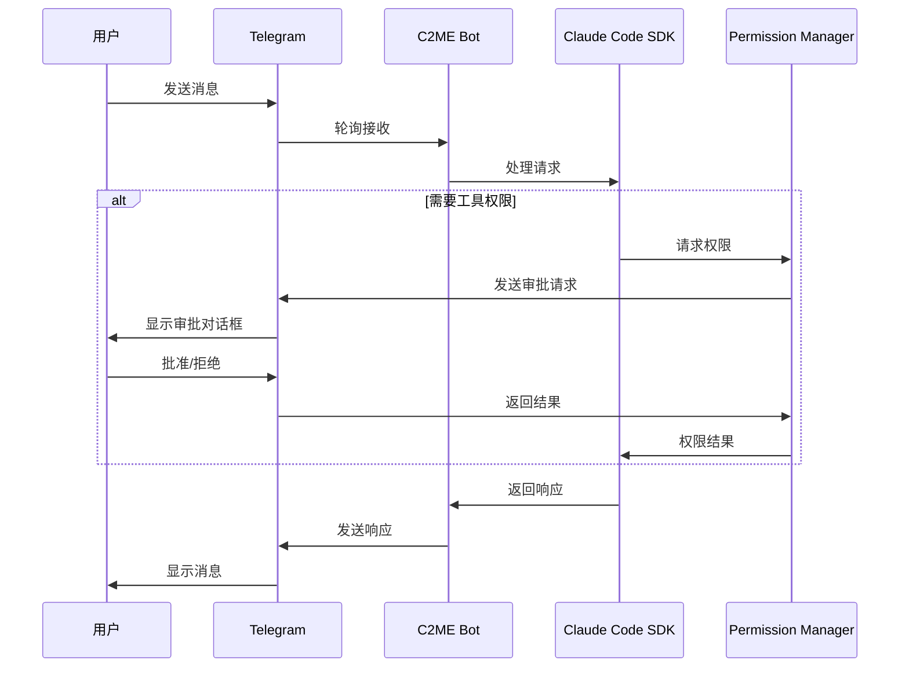

# C2ME - Claude Code Mobile Edition

<p align="center">
  
  
  
  
  
</p>

<p align="center">
  <b>将 Claude Code 的强大能力带到 Telegram，随时随地进行 AI 辅助编程</b>
</p>

<p align="center">
  <a href="#-功能特性">功能特性</a> •
  <a href="#-快速开始">快速开始</a> •
  <a href="#-桌面应用">桌面应用</a> •
  <a href="#-架构设计">架构设计</a> •
  <a href="#-开发指南">开发指南</a>
</p>

---

## 🎯 项目简介

C2ME (Claude Code Mobile Edition) 是一个将 [Claude Code SDK](https://docs.anthropic.com/en/docs/claude-code) 与 Telegram 深度集成的项目，让你可以通过手机随时随地使用 Claude 的 AI 编程能力。

### 为什么选择 C2ME？

| 传统方式 | C2ME |
|---------|------|
| 需要电脑才能使用 Claude Code | 📱 手机上随时编程 |
| 复杂的终端界面 | 💬 自然的对话交互 |
| 无法远程管理项目 | 🌍 随时随地访问 |
| 单一本地使用 | 🖥️ 支持桌面应用管理 |

## ✨ 功能特性

### 🤖 核心功能

- **Claude Code 集成** - 完整集成 Anthropic Claude Code SDK
- **项目管理** - 创建、切换、管理多个编程项目
- **文件浏览器** - 通过 Telegram 内联键盘浏览目录结构
- **权限控制** - 多种权限模式，安全管理工具调用
- **会话持久化** - Redis/Memory 双存储后端
- **实时进度追踪** - 显示 Claude 当前操作状态

### 📱 移动优化

- **可视化 Diff** - 代码变更前显示完整差异对比
- **一键审批** - 通过内联键盘快速批准/拒绝操作
- **消息批处理** - 智能合并消息，优化移动端阅读
- **速率限制保护** - 自动处理 Telegram API 限制

### 🖥️ 桌面应用 (Tauri)

- **系统托盘** - 后台运行，随时控制
- **原生菜单栏** - macOS 原生体验，快捷键支持
- **Bot 进程管理** - 启动/停止/重启 Bot
- **实时日志流** - 查看 Bot 运行日志
- **配置管理** - 图形化配置 .env 文件

## 🚀 快速开始

### 环境要求

- Node.js 18+
- pnpm (推荐) / npm / yarn
- Redis (可选，用于持久化存储)
- [Claude Code CLI](https://docs.anthropic.com/en/docs/claude-code)

### 安装步骤

```bash
# 1. 克隆项目
git clone https://github.com/poer2023/c2me.git
cd c2me

# 2. 安装依赖
pnpm install

# 3. 配置环境变量
cp .env.example .env
# 编辑 .env 文件

# 4. 启动 Bot
pnpm run dev
```

### 环境变量配置

```env
# 必需配置
TG_BOT_TOKEN=your_telegram_bot_token    # 从 @BotFather 获取
CLAUDE_CODE_PATH=claude                  # Claude Code CLI 路径
WORK_DIR=/path/to/projects               # 项目工作目录

# 可选配置
STORAGE_TYPE=memory                      # memory 或 redis
REDIS_URL=redis://localhost:6379         # Redis 连接地址
LOG_LEVEL=info                           # 日志级别

# 认证配置 (可选)
SECURITY_SECRET_REQUIRED=false
SECURITY_SECRET_TOKEN=your_secret

# Cloudflare Workers (可选)
WORKERS_ENABLED=false
WORKERS_ENDPOINT=your_endpoint
WORKERS_API_KEY=your_key
```

### 创建 Telegram Bot

1. 打开 Telegram，搜索 `@BotFather`
2. 发送 `/newbot` 命令
3. 按提示设置 Bot 名称和用户名
4. 复制获得的 Token 到 `.env` 文件

## 🖥️ 桌面应用

C2ME 提供基于 Tauri 的原生桌面应用，用于管理 Bot 运行状态。

### 功能

| 功能 | 快捷键 | 说明 |
|------|--------|------|
| 启动 Bot | `⌘R` | 启动 Telegram Bot |
| 停止 Bot | `⌘.` | 停止运行中的 Bot |
| 重启 Bot | `⌘⇧R` | 重启 Bot |
| 查看日志 | `⌘L` | 切换到日志面板 |
| 设置 | `⌘,` | 打开配置面板 |

### 构建桌面应用

```bash
cd desktop

# 安装依赖
pnpm install

# 开发模式
pnpm tauri dev

# 生产构建
pnpm tauri build
```

## 📖 使用指南

### Bot 命令

| 命令 | 说明 |
|------|------|
| `/start` | 初始化 Bot |
| `/createproject` | 创建新项目 |
| `/listproject` | 列出所有项目 |
| `/exitproject` | 退出当前项目 |
| `/ls` | 浏览当前目录 |
| `/status` | 查看会话状态 |
| `/progress` | 进度追踪设置 |
| `/clear` | 清除当前会话 |
| `/abort` | 中止当前查询 |
| `/help` | 显示帮助信息 |

### 权限模式

| 命令 | 模式 | 说明 |
|------|------|------|
| `/default` | 默认模式 | 每个工具调用需要审批 |
| `/acceptedits` | 自动接受编辑 | 自动批准文件编辑 |
| `/plan` | 规划模式 | 只读模式，用于代码设计 |
| `/bypass` | 绕过模式 | 跳过所有权限检查 |

### 使用示例

```
用户: 帮我创建一个 Express 服务器

Claude: 我来帮你创建一个基础的 Express 服务器...

[📝 编辑文件] server.js
+const express = require('express');
+const app = express();
+...

[✅ 批准] [❌ 拒绝]
```

## 🏗️ 架构设计

### 系统架构

```
┌─────────────────────────────────────────────────────────────┐
│                     Telegram Client                          │
└─────────────────────────────────────────────────────────────┘
                              │
                              ▼
┌─────────────────────────────────────────────────────────────┐
│                     TelegramHandler                          │
│  ┌──────────┐ ┌──────────┐ ┌──────────┐ ┌──────────────┐    │
│  │ Command  │ │ Message  │ │ Callback │ │ FileBrowser  │    │
│  │ Handler  │ │ Handler  │ │ Handler  │ │   Handler    │    │
│  └──────────┘ └──────────┘ └──────────┘ └──────────────────┘│
└─────────────────────────────────────────────────────────────┘
                              │
                              ▼
┌─────────────────────────────────────────────────────────────┐
│                      ClaudeManager                           │
│  ┌──────────────────┐  ┌───────────────────────────────┐    │
│  │ Claude Code SDK  │  │    Permission Manager         │    │
│  └──────────────────┘  └───────────────────────────────┘    │
└─────────────────────────────────────────────────────────────┘
                              │
                              ▼
┌─────────────────────────────────────────────────────────────┐
│                   Storage Layer                              │
│  ┌──────────────────┐  ┌───────────────────────────────┐    │
│  │   Redis Storage  │  │      Memory Storage           │    │
│  └──────────────────┘  └───────────────────────────────┘    │
└─────────────────────────────────────────────────────────────┘
```

### 消息流程



### 目录结构

```
c2me/
├── src/
│   ├── config/           # 配置管理
│   ├── constants/        # 常量定义
│   ├── handlers/         # 核心处理器
│   │   ├── claude.ts     # Claude SDK 集成
│   │   ├── telegram.ts   # Telegram 协调器
│   │   └── telegram/     # Telegram 子处理器
│   ├── models/           # 数据模型
│   ├── queue/            # 消息队列
│   ├── services/         # 业务服务
│   ├── storage/          # 存储抽象
│   └── utils/            # 工具函数
│       ├── logger.ts     # Pino 日志
│       ├── metrics.ts    # 性能指标
│       └── rate-limiter.ts
├── desktop/              # Tauri 桌面应用
│   ├── src/              # React 前端
│   └── src-tauri/        # Rust 后端
├── workers/              # Cloudflare Workers
└── tests/                # 测试文件
    ├── unit/             # 单元测试
    └── integration/      # 集成测试
```

## 🧪 测试

```bash
# 运行所有测试
pnpm test

# 监视模式
pnpm test:watch

# 覆盖率报告
pnpm test:coverage
```

### 测试覆盖

| 模块 | 测试数 | 状态 |
|------|--------|------|
| AsyncQueue | 15 | ✅ |
| RateLimiter | 11 | ✅ |
| MemoryStorage | 17 | ✅ |
| UserSession | 18 | ✅ |
| MessageBatcher | 10 | ✅ |
| Claude Flow | 18 | ✅ |
| **总计** | **89** | ✅ |

## 📦 开发指南

### 可用脚本

```bash
pnpm run build      # 构建生产版本
pnpm run dev        # 开发模式运行
pnpm run lint       # ESLint 检查
pnpm run lint:fix   # 自动修复 lint 问题
pnpm run format     # Prettier 格式化
pnpm test           # 运行测试
```

### 技术栈

| 类别 | 技术 |
|------|------|
| 运行时 | Node.js 18+ |
| 语言 | TypeScript 5.8 |
| Telegram SDK | Telegraf 4.x |
| AI SDK | @anthropic-ai/claude-agent-sdk |
| 存储 | Redis / Memory |
| 日志 | Pino |
| 测试 | Vitest |
| 桌面应用 | Tauri 2.0 (Rust + React) |
| 边缘服务 | Cloudflare Workers |

## 🤝 贡献

欢迎贡献代码！请遵循以下步骤：

1. Fork 本仓库
2. 创建特性分支 (`git checkout -b feature/amazing-feature`)
3. 提交更改 (`git commit -m 'feat: add amazing feature'`)
4. 推送到分支 (`git push origin feature/amazing-feature`)
5. 提交 Pull Request

## 📄 许可证

MIT License - 详见 [LICENSE](LICENSE) 文件

## 🔗 相关链接

- [Claude Code 官方文档](https://docs.anthropic.com/en/docs/claude-code)
- [Telegram Bot API](https://core.telegram.org/bots/api)
- [Tauri 官方文档](https://tauri.app/)

---

<p align="center">
  Made with ❤️ by <a href="https://github.com/poer2023">poer2023</a>
</p>
