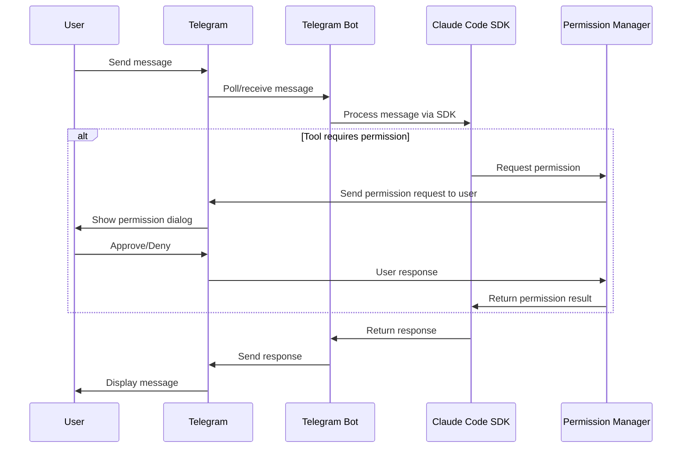

# Telegram Claude Code Bot

[🇨🇳 中文文档](README-zh.md)

<a href="https://www.producthunt.com/products/chatcode?embed=true&utm_source=badge-featured&utm_medium=badge&utm_source=badge-chatcode" target="_blank"></a>

## Demo Video

[](https://www.youtube.com/watch?v=rhsV6_z9G9c)

A powerful Telegram bot that integrates with Claude Code to provide AI-powered coding assistance directly through Telegram. **Uses telegram polling mode - runs on any computer with internet connection, no public IP or domain required.**

This bot allows users to interact with Claude's coding capabilities in a conversational interface with features like project management, file browsing, and comprehensive permission controls.

## Features

- **Claude Code Integration**: Direct integration with Anthropic's Claude Code SDK
- **Project Management**: Create, list, and manage coding projects
- **File Browser**: Navigate and explore project directories through Telegram
- **Permission System**: Multiple permission modes for secure interaction
- **Session Management**: Persistent user sessions with Redis or memory storage
- **Tool Handling**: Advanced tool use detection and management
- **Message Batching**: Efficient message processing and delivery
- **Permission Control**: Advanced permission system for secure tool usage
- **Cloudflare Workers**: Optional Workers integration for diff and file view

## Mobile-Optimized Experience for Telegram

This bot is specifically designed and optimized for Telegram usage scenarios, providing an excellent mobile experience through several key innovations:

### 1. **Natural Permission Control**
Provides natural permission control workflow through an integrated permission system. Users can easily approve or deny tool operations through intuitive inline keyboards, making permission management seamless on mobile devices.

### 2. **Visual Diff Display for Edits**
All code editing operations display comprehensive diff views, allowing users to review changes before approval. This visual feedback is essential for mobile users who need clear context about what changes are being made to their code.

### 3. **Integrated File Browser**
Features a built-in file browser with keyboard navigation that makes it easy to explore project directories directly within Telegram. Users can navigate folder structures, view files, and understand project context without leaving the chat interface.

### 4. **Essential Operation Support**
Supports commonly needed operations optimized for chat interface:
- `/clear` - Clear current session and start fresh
- `/abort` (ESC equivalent) - Abort current Claude query
- `/plan` - Enter planning mode for code design discussions
- Quick permission mode switches (`/default`, `/acceptedits`, `/bypass`)

### 5. **Tool Interaction Adaptation**
All Claude Code tools are adapted for Telegram's message-based interface:
- **Streamlined Information Display**: Complex tool outputs are formatted for mobile readability
- **Interactive Confirmations**: File operations, code changes, and tool executions use inline keyboards for one-tap approval

These optimizations ensure that users can effectively manage coding projects, review changes, and interact with AI assistance comfortably from their mobile devices through Telegram.

## Installation & Deployment

### Easy Setup - No Server Required

This bot uses **Telegram polling mode**, which means:
- ✅ No public IP address needed
- ✅ No domain name required  
- ✅ No port forwarding or firewall configuration
- ✅ Works behind NAT/firewall
- ✅ Can run on any computer with internet access
- ✅ Perfect for personal development machines or private servers

### Prerequisites

- Node.js 18+ 
- Package manager: pnpm (recommended), npm, or yarn
- Redis (optional, for persistent storage)
- Claude Code CLI tool

### Quick Start

1. Clone the repository:
```bash
git clone <repository-url>
cd chatcode
```

2. Install dependencies:
```bash
# Using pnpm (recommended)
pnpm install

# Or using npm/yarn
npm install  # yarn install
```

3. Create a Telegram bot and get your token:
   - Open Telegram and search for `@BotFather`
   - Send `/newbot` command to BotFather
   - Follow the instructions to choose a name and username for your bot
   - Copy the bot token provided by BotFather
   - Add the token to your `.env` file (see Configuration section below)

4. Configure environment variables (see Configuration section below)

5. Build and start:
```bash
# Development mode
pnpm run dev

# Production mode
pnpm run build && pnpm start
```

Simply configure your environment variables and run - the bot will poll Telegram's servers directly.

### Cloudflare Workers (Optional)

**When `WORKERS_ENABLED=true`, you need to deploy Cloudflare Workers and configure environment variables:**

#### 1. Local Environment Setup
In your `.env` file in the project root:
```env
WORKERS_ENABLED=true
WORKERS_ENDPOINT=your_workers_endpoint
WORKERS_API_KEY=your_secure_api_key_here
```

#### 2. Create KV Bindings and Deploy Workers
**Before deploying, you need to create KV namespaces in Cloudflare dashboard:**
1. Go to Cloudflare Dashboard > Workers & Pages > KV
2. Create a new KV namespace (name:"CHATCODE")
3. Copy the KV namespace ID and update `wrangler.toml` with the correct binding ID

```bash
cd workers
pnpm install
wrangler deploy
```

#### 3. Configure Workers Environment Variables
In the Cloudflare Workers dashboard, set the following environment variable:
- **Variable Name**: `API_KEY`
- **Value**: `{WORKERS_API_KEY}` (same value as in your local `.env` file)

#### 4. Workers Features
The Workers service provides:
- Diff content viewing service (`/api/diff`)
- File viewing service (`/api/file`)
- HTML rendering interface (`/diff`, `/file`)

## Configuration

Create a `.env` file with the following environment variables:

### Required Configuration

```env
TG_BOT_TOKEN=your_telegram_bot_token  # Get this from @BotFather on Telegram
BOT_MODE=polling  # Uses polling mode - no public IP or domain needed
CLAUDE_CODE_PATH=claude
WORK_DIR=/tmp/tg-claudecode  # Directory where GitHub projects will be cloned here
```

### Optional Configuration

```env
# Storage
STORAGE_TYPE=redis  # or 'memory'
REDIS_URL=redis://localhost:6379
SESSION_TIMEOUT=7d

# Security
SECURITY_SECRET_REQUIRED=false
SECURITY_SECRET_TOKEN=your_secret_token

# Workers (optional)
WORKERS_ENABLED=false
WORKERS_ENDPOINT=your_workers_endpoint
WORKERS_API_KEY=your_workers_api_key
```

## Authentication Configuration

By default, anyone who finds your bot can use it. To protect your Claude Code access, you can enable authentication.

### Enable Authentication

Add these environment variables to your `.env`:

```env
SECURITY_SECRET_REQUIRED=true
SECURITY_SECRET_TOKEN=your_secret_password_here
```

### Usage

When authentication is enabled:
1. New users must send the secret token to the bot before they can use it
2. Use `/auth` command to check authentication status. send `/auth token`
3. Authenticated users stay logged in until the session expires

Generate a secure token:
```bash
openssl rand -hex 16
```

## Usage

### Bot Commands

- `/start` - Initialize the bot and create user session
- `/createproject` - Create a new coding project
- `/listproject` - List all available projects
- `/exitproject` - Exit current project
- `/help` - Show help information
- `/status` - Show current session status
- `/ls` - Browse current directory
- `/auth` - Authentication management
- `/abort` - Abort current Claude query
- `/clear` - Clear current session

### Permission Modes

- `/default` - Default permission mode
- `/acceptedits` - Accept all edit operations
- `/plan` - Planning mode (read-only)
- `/bypass` - Bypass all permission checks

### Interaction

Simply send text messages to the bot to interact with Claude Code. The bot will:

1. Process your message through Claude Code
2. Handle any tool uses or file operations
3. Return formatted responses with syntax highlighting
4. Manage project context and file browsing

## Architecture

The bot is built with a modular architecture consisting of:

- **Main Application** (`src/main.ts`): Entry point and orchestration
- **Claude Manager** (`src/handlers/claude.ts`): Claude Code SDK integration
- **Telegram Handler** (`src/handlers/telegram.ts`): Telegram bot logic coordination
- **Storage Layer**: Redis or memory-based session storage
- **Permission System**: Integrated permission control for tool usage
- **Workers Support**: Optional Cloudflare Workers integration

### Message Flow Architecture



The architecture follows this flow:

1. **User Input**: User sends a message through Telegram
2. **Message Reception**: Bot polls Telegram API and receives the message
3. **Claude Processing**: Message is forwarded to Claude Code SDK for processing
4. **Permission Check**: If Claude requires tool use permissions:
   - Claude Code SDK calls the permission manager's canUseTool function
   - Permission manager sends permission request to user via Telegram
   - User approves or denies the request through inline keyboard
   - Permission manager returns the permission result to Claude Code SDK
5. **Response Generation**: Claude processes the request and generates response
6. **Message Delivery**: Bot sends the formatted response back to user via Telegram

## Development

### Project Structure

```
src/
├── config/          # Configuration management
├── constants/       # Constants and messages
├── handlers/        # Core handlers
│   ├── claude.ts    # Claude Code integration
│   ├── telegram.ts  # Telegram coordination
│   ├── github.ts    # GitHub operations
│   ├── directory.ts # Directory management
│   └── telegram/    # Telegram-specific handlers
├── models/          # Data models and types

├── queue/          # Message batching
├── server/         # Express server for webhooks
├── services/       # Business logic services
├── storage/        # Storage abstraction layer
└── utils/          # Utility functions

workers/            # Cloudflare Workers integration
```

### Available Scripts

Use `pnpm`, `npm`, or `yarn` to run these scripts:

- `[pnpm|npm|yarn] run build` - Build TypeScript to JavaScript
- `[pnpm|npm|yarn] start` - Start the production bot  
- `[pnpm|npm|yarn] run dev` - Start development server with watch mode
- `[pnpm|npm|yarn] run watch` - Watch mode for development
- `[pnpm|npm|yarn] run lint` - Run ESLint
- `[pnpm|npm|yarn] run lint:fix` - Fix linting issues
- `[pnpm|npm|yarn] run format` - Format code with Prettier

### Key Components

#### Claude Manager
Handles all interactions with the Claude Code SDK, including:
- Message streaming and processing
- Session management and resumption
- Tool use detection and extraction
- Query abortion and lifecycle management

#### Telegram Handler
Coordinates all Telegram bot functionality:
- Command routing and processing
- Message handling and formatting
- Callback query management
- File browser integration

#### Storage Layer
Provides abstraction for user session storage:
- Redis backend for production
- Memory backend for development
- Session timeout and cleanup
- User authentication state

## Contributing

1. Fork the repository
2. Create a feature branch
3. Make your changes
4. Run tests and linting
5. Submit a pull request

## License

MIT License - see LICENSE file for details

## Support

For issues and questions:
- Check the existing issues
- Create a new issue with detailed information
- Include logs and configuration (without sensitive data)

## Star History

[](https://www.star-history.com/#Nickqiaoo/chatcode&Date)